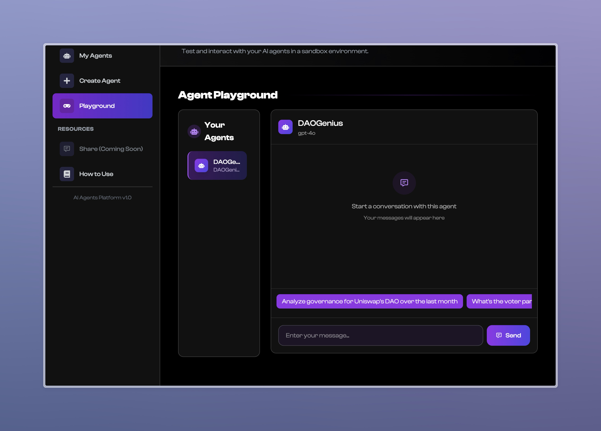

# DAOGenius - DAO Governance Analytics

A comprehensive solution for DAO governance analytics, powered by PAAL AI.

<div align="center">
  
  <br><br>
  
</div>

## Live Demo

Check out the live demo: [DAOGenius on Vercel](https://dao-genius-paal-ai.vercel.app/)

## Project Structure

This repository contains:

- **Backend API**: A TypeScript-based RESTful API providing governance analytics for DAOs
- **Frontend Showcase**: A React-based demonstration frontend for the DAOGenius bot

## Backend: Governance Analytics API

Located in `/api/governance-analytics-ts`

### Features

- **Governance Overview**: Get comprehensive analytics about a DAO's governance
- **Proposal Analytics**: Detailed insights about governance proposals
- **Voter Analytics**: Analyze voter behavior and participation patterns
- **DAO Comparison**: Compare governance metrics against similar DAOs
- **Secure Authentication**: JWT-based authentication for API access

For detailed backend documentation, see [Backend README](api/governance-analytics-ts/README.md).

## Frontend: Showcase UI

Located in `/frontend`

### Features

- Simulated chat interface with the DAOGenius AI assistant
- Overview of key features and capabilities
- Direct integration with the PAAL AI platform
- Fully responsive design for mobile and desktop devices

### Running the Frontend

```bash
cd frontend
npm install
npm start
```

For detailed frontend documentation, see [Frontend README](frontend/README.md).

## Deployment

The frontend is deployed using Vercel at [https://dao-genius-paal-ai.vercel.app/](https://dao-genius-paal-ai.vercel.app/).

To deploy your own version:

```bash
# Build the production version
cd frontend
npm run build

# Deploy to your preferred hosting service
# For Vercel:
vercel
```

## Integration with PAAL AI

This project integrates with the PAAL AI platform, which hosts the actual DAOGenius bot. The frontend showcase provides a demonstration of the bot's capabilities and redirects users to the PAAL AI platform for full interaction.

## License

This project is licensed under the MIT License. 