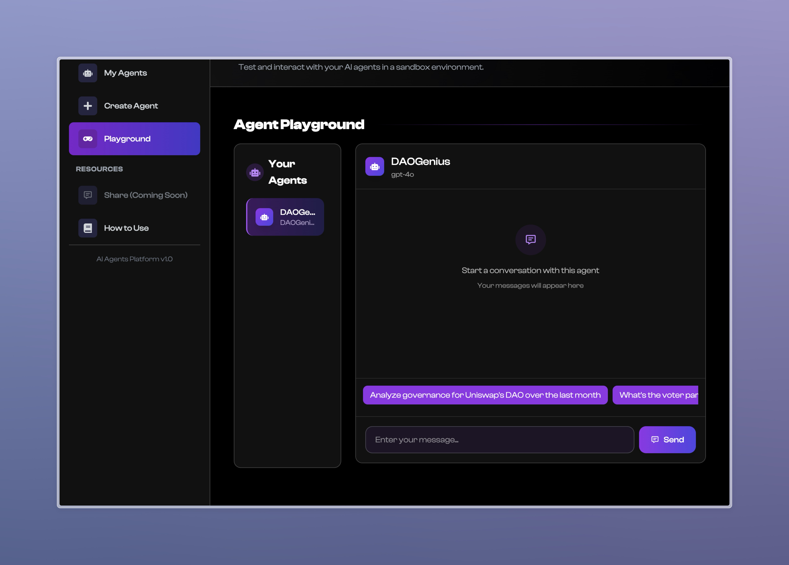

# DAOGenius Frontend

A simple showcase frontend for the DAOGenius DAO Governance Analytics service, powered by PAAL AI.

<div align="center">
  
  <br><br>
  
</div>

## Live Demo

Check out the live demo: [DAOGenius on Vercel](https://dao-genius-paal-ai.vercel.app/)

## Overview

This frontend provides a visual representation of the DAOGenius bot capabilities, showcasing:

- A simulated chat interface with the DAOGenius AI assistant
- Key features and capabilities of the analytics service
- Integration with the PAAL AI platform
- Fully responsive design for mobile and desktop devices

## Getting Started

### Prerequisites

- Node.js (v14 or later)
- npm or yarn

### Installation

1. Clone the repository
2. Navigate to the frontend directory:
   ```
   cd frontend
   ```
3. Install dependencies:
   ```
   npm install
   ```
   or
   ```
   yarn install
   ```

### Running the Development Server

Start the development server:

```
npm start
```

The application will be available at [http://localhost:3000](http://localhost:3000).

### Building for Production

Build the application for production:

```
npm run build
```

The build artifacts will be stored in the `build/` directory.

## Deployment

The frontend is deployed using Vercel at [https://dao-genius-paal-ai.vercel.app/](https://dao-genius-paal-ai.vercel.app/).

To deploy your own version:

```bash
# Build the production version
npm run build

# Deploy to Vercel (if you have Vercel CLI installed)
vercel
```

## Connecting to the Backend

This frontend is designed to showcase the DAOGenius bot available on the PAAL AI platform. The "Try DAOGenius" button redirects users to the PAAL AI website where they can interact with the actual bot.

## License

This project is licensed under the MIT License. 